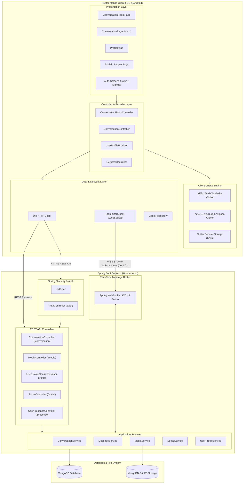

# System Architecture & Design Rationale

This document details the architectural decisions behind Kite, focusing on **Spring Modulith** domain boundaries on the backend, **Clean Architecture** on the Flutter frontend, and the real-time event lifecycle.

---

## Architectural Rationale

### Why Spring Modulith?
Microservices often introduce distributed tracing overhead, network latency, and deployment complexity that are unnecessary for many applications. Spring Modulith allows Kite to maintain strict, isolated module boundaries inside a single deployable artifact:

* **Explicit Domain Boundaries**: Modules communicate across boundaries through explicit Java APIs or asynchronous application events.
* **Spring Modulith Verification**: Modulith verification tests ensure that internal module components do not illegally leak into other domain packages.
* **Event-Driven Decoupling**: Domain actions (such as accepting a friend request) publish internal application events (`@ApplicationModuleListener`) to handle side-effects like 1-on-1 chat creation and real-time STOMP notifications.

### Why Clean Architecture in Flutter?
On the mobile frontend, keeping presentation logic separated from cryptographic operations and network datasources is critical for maintainability:

* **Presentation Layer**: UI Widgets and State Controllers (`ConversationRoomController`, `ConversationController`, `UserProfileProvider`) manage reactive view state.
* **Domain Layer**: Pure Dart entities and repository interfaces define the core business rules.
* **Data Layer**: Concrete repository implementations (`MediaRepositoryImpl`, `ConversationRepositoryImpl`) handle `Dio` HTTP calls, `StompDartClient` socket messages, and `AES-256 GCM` crypto stream transformations.

---

## System Architecture Diagram

---

## Real-Time Synchronization & Spring Modulith Events

1. **Friend Request Acceptance**: When a user accepts a friend request (`PUT /social/accept/{relationId}`), `SocialService` emits an internal application event.
2. **Chat Initialization**: `ConversationService` listens for the event, initializes a direct chat in MongoDB, and formats the new `ConversationResponse`.
3. **STOMP Broadcast**: `SimpMessagingTemplate` sends the updated conversation payload to `/topic/user.{userId}.conversations` for both users.
4. **Client View Update**: The Flutter client's WebSocket listener receives the STOMP frame and prepends the new chat tile to the user's inbox list in real-time.

---

## Spring Modulith Backend Domain Modules

The backend architecture consists of isolated domain modules managed by Spring Modulith:

* **`conversation`**: Core messaging domain, 1-on-1 and group chat rooms, message persistence, and real-time STOMP topic broadcasting.
* **`social`**: User discovery, relationship state management, friend requests, and automatic direct chat triggers.
* **`media`**: GridFS storage management for unencrypted avatars and binary ciphertext stream uploads/downloads.
* **`profile`**: User metadata, public key directory management, and theme preferences.
* **`notification`**: Internal Spring Modulith event listeners (`@ApplicationModuleListener`) for push alerts and system notifications.
* **`presence`**: User online and offline status tracking over WebSockets.
* **`security`**: JWT authentication filter (`JwtFilter`), Spring Security configuration, and user principal context.
* **`shared`**: Cross-cutting domain primitives, strongly typed identifiers (`UserId`, `ConversationId`), global exception handling, and common mappers.
