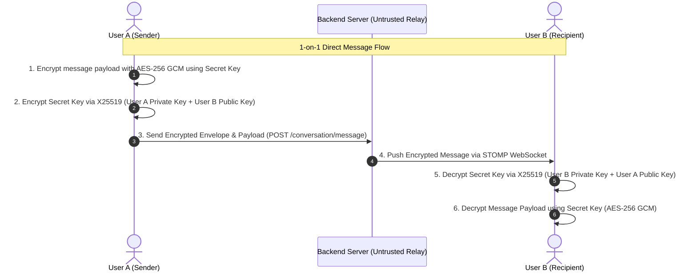
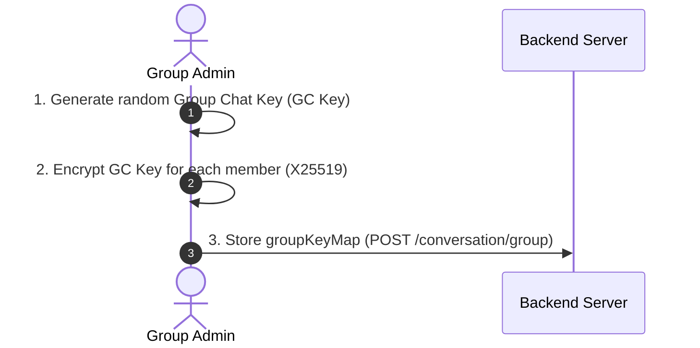
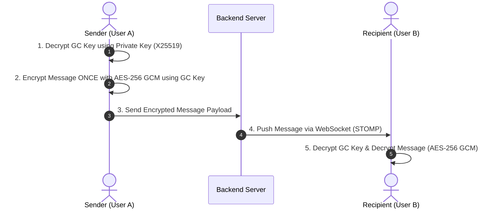
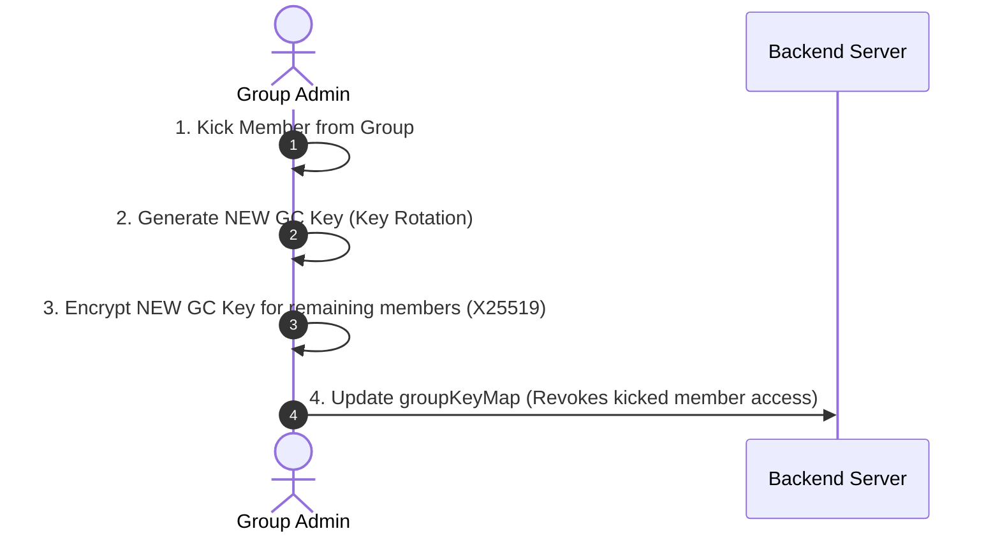

# End-to-End Encryption (E2EE) & Security Specification

Kite operates on a strict **zero-knowledge trust model**. The application architecture ensures that the central backend server acts strictly as an untrusted message broker and media host. All encryption and decryption operations take place client-side on user devices. The server never possesses private keys or unencrypted message payloads.

---

## 1. User Onboarding & Key Generation

Whenever a user signs up for an account (`POST /auth/sign-up`):

1. **Keypair Generation**: The client application locally generates an asymmetric key pair using **X25519 Elliptic-Curve Diffie-Hellman (ECDH)**.
2. **Local Private Key Storage**: The private key is saved locally on the user's mobile device inside hardware-backed secure storage (`Flutter Secure Storage` using iOS Keychain and Android KeyStore). The private key **never leaves the client device**.
3. **Public Key Directory**: The public key is uploaded to the backend server during registration and stored in the user profile directory. Other users retrieve this public key to establish encrypted communication channels.

---

## 2. Direct 1-on-1 Chat Encryption & Decryption

When **User A** wants to send a direct message to **User B**:

### Encryption Steps (User A)
1. **Symmetric Payload Cipher**: User A encrypts the plaintext message using **AES-256 GCM** with a randomly generated secret key.
2. **Asymmetric Key Envelope**: User A derives a shared secret using **User A's private key** and **User B's public key** via X25519 ECDH. User A encrypts the secret key using this shared secret.
3. **Transmission**: User A sends the encrypted secret key envelope, AES-GCM ciphertext, nonce, and authentication tag to the server.

### Decryption Steps (User B)
1. **Key Envelope Decryption**: User B uses **User B's private key** and **User A's public key** via X25519 to derive the exact same shared secret. User B decrypts the envelope to retrieve the secret key.
2. **Payload Decryption**: User B uses the secret key to decrypt the AES-256 GCM ciphertext back into original plaintext.

---

## 3. Group Chat Encryption Architecture

### Initial Naive Approach & Limitations
In the initial design consideration, whenever User A sent a group message, User A would encrypt the message $N$ separate times for each of the $N$ members of the group chat.

This approach had severe engineering limitations:
1. **Computational & Bandwidth Overhead $O(N)$**: Encrypting and transmitting payloads $N$ times scales poorly as group membership grows.
2. **Historical Access Limitation for New Members**: When a new user is added to an existing group chat, that new user cannot decrypt past messages because previous messages were encrypted strictly for members who belonged to the group at the time of sending.

### Implemented Group Key Distribution Architecture

To solve these limitations cleanly, Kite uses a **Group Chat (GC) Key Architecture** divided into three distinct operations:

#### Phase A: Group Creation & Initial Key Distribution

#### Phase B: Group Message Transmission & Decryption

#### Phase C: Kicking Members & Key Rotation

1. **Group Key Generation**: When a group chat is created, the creator generates a single random **Group Chat (GC) Key**.
2. **Key Map Distribution**: The creator encrypts the GC Key for each group member using X25519 (Creator's private key + Member's public key). This mapping (`groupKeyMap`) is stored in the conversation document on the server.
3. **Efficient Group Messaging O(1)**: When any member (e.g., User C) sends a message to the group, User C decrypts the GC Key using their own private key, and encrypts the message **once** using AES-256 GCM with that GC Key.
4. **Adding Members & History Access**: When an admin adds a new member to the group chat, the admin encrypts the existing GC Key using the new member's public key. This allows the newly joined member to decrypt historical group messages.
5. **Kicking Members & Key Rotation**: When an admin kicks a member from the group chat, a **GC Key Rotation** is performed: a new GC Key is generated and encrypted for all remaining members. This revokes the kicked member's ability to decrypt future messages.

---

## 4. Media Upload Encryption (Images, Videos, Files, Audio Notes)

Media attachments follow the exact same 2-layer encryption model:

### Upload & Transmission Flow
1. **Client-Side Binary Encryption**: The client encrypts the raw uncompressed media bytes (photo, video, document, or audio recording) locally using **AES-256 GCM** with a single-use symmetric key.
2. **Multipart Upload**: The client uploads the opaque binary ciphertext stream to `POST /media/upload` via a multipart `FormData` request.
3. **Ciphertext URL**: The server stores the binary ciphertext in MongoDB GridFS and returns a public download link (`http://localhost:8080/kite/api/v1/media/download/{filename}`).
4. **Encrypted Message Payload**: The client places the download link inside the message payload. Crucial decryption attributes—including the single-use AES key, `nonce`, and authentication tag (`mac`)—are encrypted inside the X25519 signaling envelope.

Even if an unauthorized third party obtains the media download link, they receive only raw opaque ciphertext bytes that cannot be decrypted without the secret key sealed inside the envelope.

---

## 5. Client Key Management & Hardware Security

* **Private Key Isolation**: User private keys never leave the client device and are never transmitted over the network.
* **Hardware-Backed Storage**: Keys are stored using `Flutter Secure Storage`:
  * **iOS**: Encrypted inside the iOS Keychain with `kSecAttrAccessibleAfterFirstUnlock`.
  * **Android**: Encrypted using the hardware-backed Android KeyStore system.
